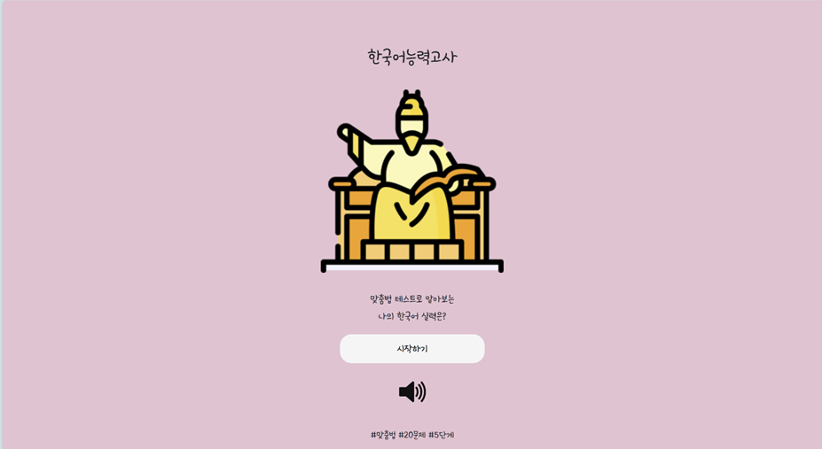
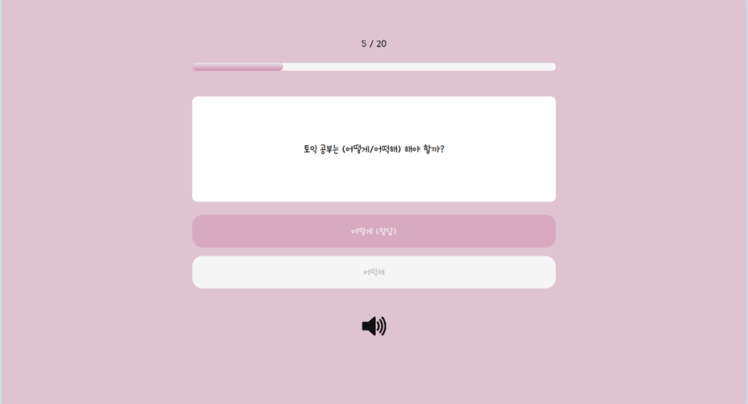
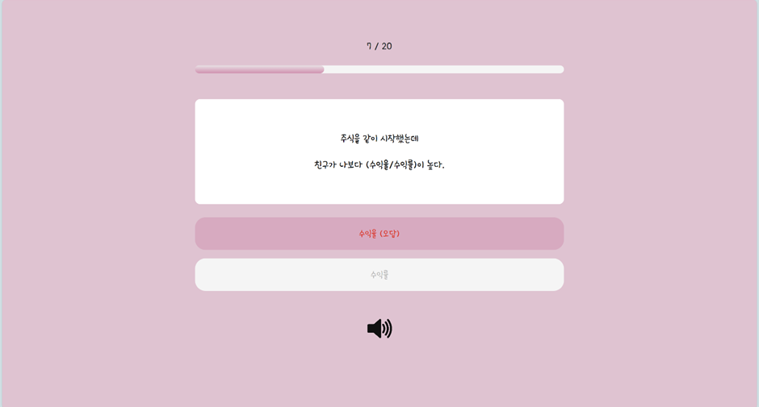
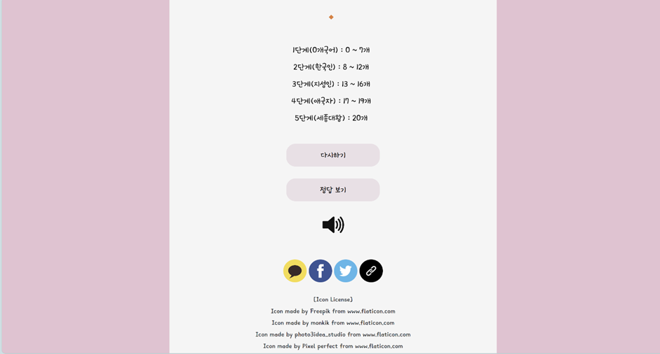
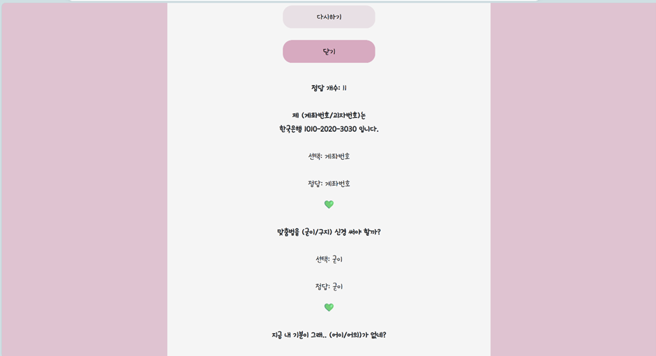
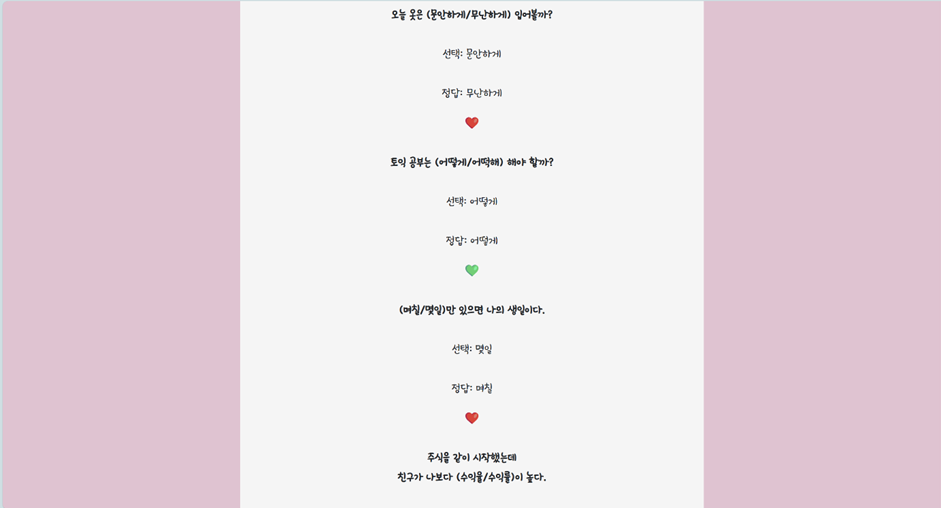

# Hangul-Spelling-Test
한글 맞춤법 퀴즈 반응형 웹사이트
  

## 👩‍💻 팀원
@EUNDINI @VanesaK @Hansol-Jeong-93
  
 
## 🛠 활용 도구
* #### 프론트엔드
  * Html
  * CSS
  * JavaScript
  * BootStrap
  

## 📑 기획
- #### Inflearn 심리 테스트 제작 강의 내용을 바탕으로 ‘한글 맞춤법 퀴즈’ 반응형 웹사이트 제작
- #### 총 20문제, 5단계의 결과지 제작
- #### 주요 기능
  - 반응형 웹사이트
  - 20개 퀴즈를 통해 점수에 따라 1~5단계로 결과 분류
  - 정답 확인하기
  - 공유하기 (카카오톡, 페이스북, 트위터, 링크 복사)

- #### 프로토타입(Figma) 
  <https://www.figma.com/file/JQFdz2Rrd1AscEOsqKEXQp/%EB%A7%9E%EC%B6%A4%EB%B2%95-Quiz?node-id=156%3A0>

 
  
## 📝 수정 및 기능 추가 사항 ( by. yyj33 )
- #### css
  - speak.css 추가 : 화면에 나오는 버튼과 문제들을 읽어주는 기능을 실행하기 위해 눌러야 하는 스피커 이미지 사이즈 및 위치 조정
  - 바탕색상, 버튼색상 변경
- #### js
  - start.js(=main.js) 
    - Answer선택시 정답인지 오답인지 알려주는 기능 추가
    - 퀴즈 결과에서 정답보기를 눌렀을 때 문제와 함께 내가 선택한 답과 정답을 보여주는 기능 추가
    - 퀴즈 결과에서 정답보기를 눌렀을 때 밑에 선택한 답과 정답이 동일하면 💚이 나오게 하고 다르면 ❤️이 나오는 기능 추가
    - 퀴즈 결과에서 정답보기를 눌렀을 때 제일 윗부분에 정답개수를 나오게 하는 기능추가
    - 스피커 이미지를 누르면 화면에 나오는 글자를 읽어주는 기능 추가
- #### html
  - speak.css 스타일 시트추가
  - 시작하기 밑에 스피커 버튼 추가 
  - 정답보기 밑에 스피커 버튼 추가
    
  
- #### 수정 이미지   

 
 
 
 
 
 